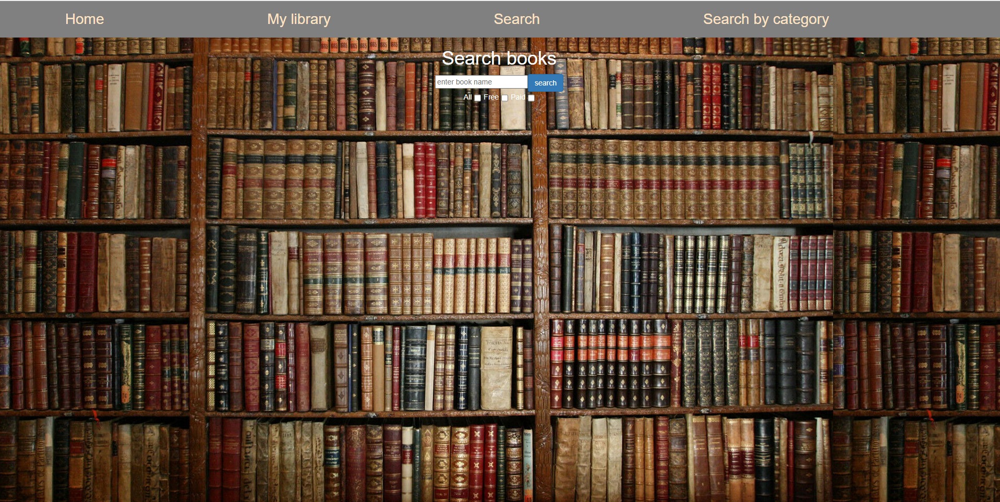
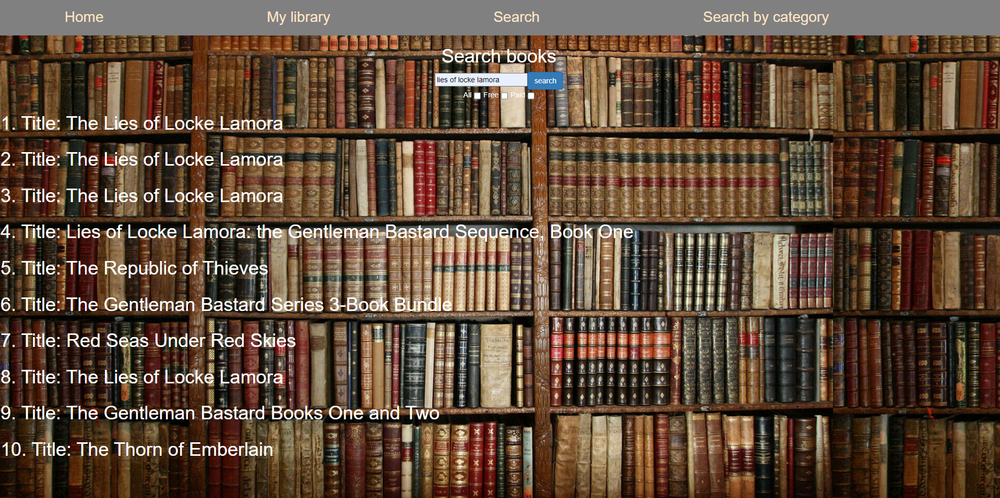
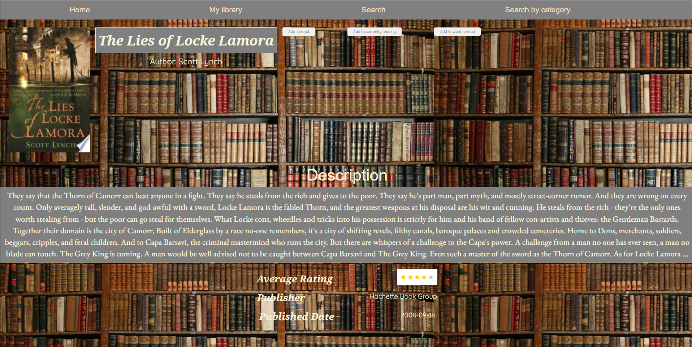
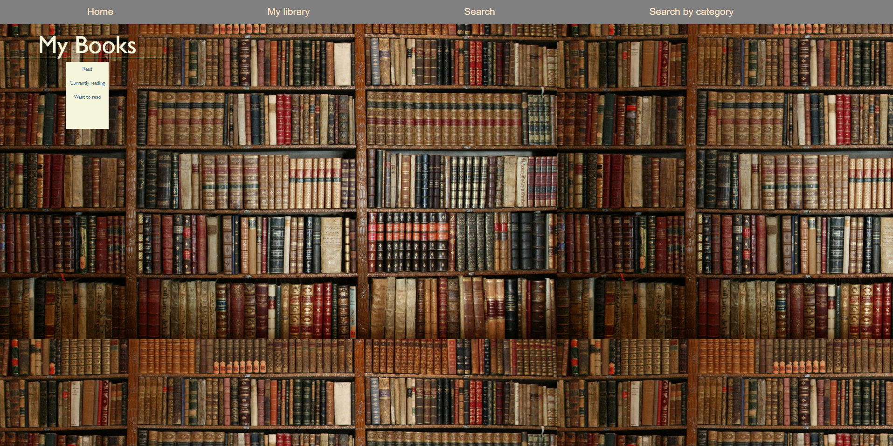
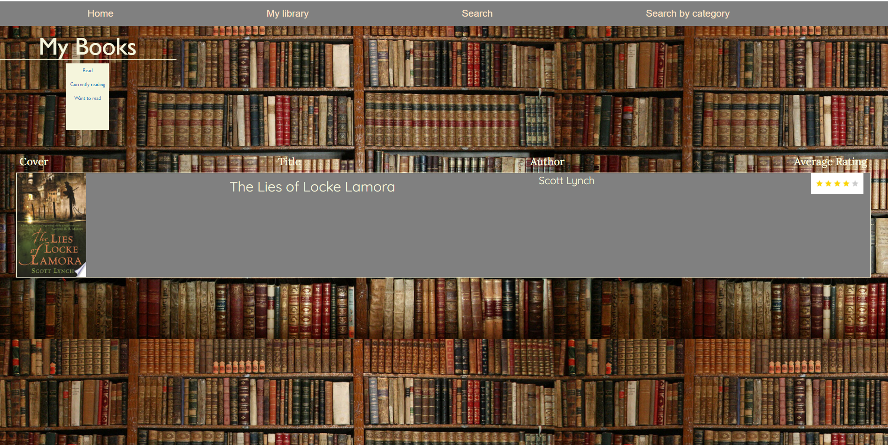
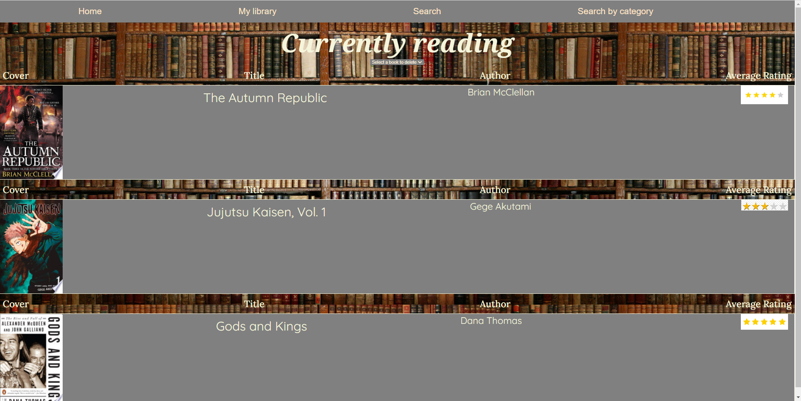
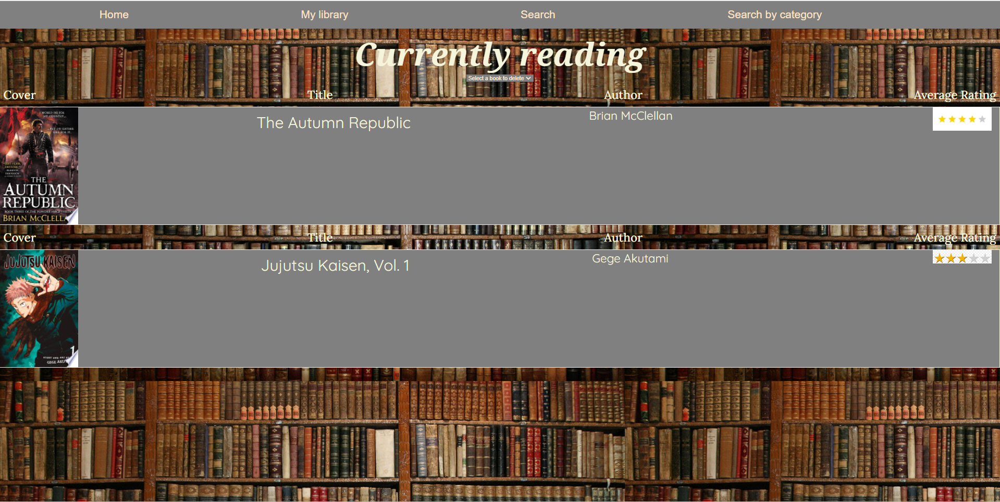

# Library App

This project creates a simple library navigation app, using React framework and written in Javascript, HTML and CSS.

## You can try out the app [here!](https://library-app-tamara703.onrender.com)


## Technologies used
```
React
Bootstrap

```

## Environments used
```
Render
```


## Services

`Google books API` You can find more information [here](https://developers.google.com/books/docs/v1/using#intro)

## Available Scripts

In the project directory, you can run:

### `npm start`

The page will reload when you make changes.\
You may also see any lint errors in the console.

### `npm test`

Launches the test runner in the interactive watch mode.\
See the section about [running tests](https://facebook.github.io/create-react-app/docs/running-tests) for more information.

### `npm run build`

Builds the app for production to the `build` folder.\
It correctly bundles React in production mode and optimizes the build for the best performance.

The build is minified and the filenames include the hashes.\
Your app is ready to be deployed!

See the section about [deployment](https://facebook.github.io/create-react-app/docs/deployment) for more information.

### `npm run eject`

**Note: this is a one-way operation. Once you `eject`, you can't go back!**

If you aren't satisfied with the build tool and configuration choices, you can `eject` at any time. This command will remove the single build dependency from your project.

Instead, it will copy all the configuration files and the transitive dependencies (webpack, Babel, ESLint, etc) right into your project so you have full control over them. All of the commands except `eject` will still work, but they will point to the copied scripts so you can tweak them. At this point you're on your own.

You don't have to ever use `eject`. The curated feature set is suitable for small and middle deployments, and you shouldn't feel obligated to use this feature. However we understand that this tool wouldn't be useful if you couldn't customize it when you are ready for it.


# Introduction

The project introduces the following functionalities:
1. Home page: this page displays the newly released books in non-fiction, fiction, mystery and more.
2. My library: this page navigates to three sub sections:
    * Read - books flagged as **read** by the user.
    * Currently reading - books flagged as **currently read** by the user
    * Want to read - books flagged as **want to read** by the user

3. Search: this page display the main search engine which will allow the user to browse books fetched directly from the **Google Books API**


## Installation
no installation required. You can click on the link above to get started


# Screenshots

### Home page


### Search page
    * Search page has the option to filter through either paid or free e-books


### Search page
    * The search engine will fetch the first ten results with the relevant search term


### Book result
    * Description of the selected book will display on click. The user can choose to add the book to the following three library sections
        1. Read
        2. Currently reading
        3. Want to read


### My library (not populated)
    * The my library page is empty by default. If a user chooses to select a book to read this page will become populated


### My library with a chosen read book
    * books that have been marked as read by the user will be displayed here


### Books selected as "Currently reading" by the user will be displayed in the "Currently reading" subsection of the library


### The user can also remove a book from their list if they wish it
    * The drop-down menu under the subsection title will allow the user to remove a book from their list



## Future contributions
1. Make the UI prettier!
2. Refactor some method for reusability purposes
3. Clean certain components of redundant/unused variables & methods
4. Fix issue when clicking on a certain title on homepage, a **thumbnail no defined** error occurs
5. Add functionality to the **Search Category** page where the user can browse books based on their genre


## Credits
Thank you for all my instructors and fellow peers in the Per Scholas Cycle 10 for making this project logical and fun to make!
